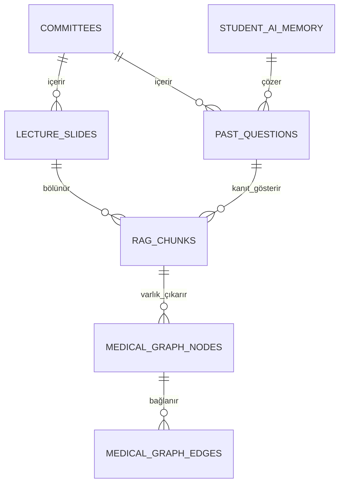

# MedSoru AI: Sistem Mimarisi, Boru Hattı ve Yapay Zeka Talimatnamesi (AGENTS.md)
> **Hedef Kitle:** Yapay Zeka Asistanları (Antigravity, Cursor, Claude, GPT, Ollama yerel modelleri) ve Geliştiriciler.  
> **Temel İlke:** Bu proje tamamen **yerel donanım (Zero-Cost Local GPU)** ve **kanıtlanabilir tıp verisi (Zero-Hallucination Medical RAG)** prensibiyle çalışır.

---

## 1. Proje Özeti ve Amaç
MedSoru, Tıp Fakültesi Dönem 3 kurul ders slaytları, amfi notları ve geçmiş çıkmış sınav sorularını otomatik işleyen, temizleyen, zenginleştiren ve anlamsal olarak birbirine bağlayan uçtan uca otonom bir yapay zeka tıp ekosistemidir.

### Temel Çıktılar:
1. **Doğrulanmış Soru Bankası:** 5 şıklı, amfi ders notundan kanıtlı, açıklamalı ve detaylandırılmış tıp soruları.
2. **GraphRAG & Hibrit Arama:** Hastalık-ilaç-semptom ilişkilerini içeren bilgi grafı (`DiGraph`) ve `BM25 + BGE-M3` hibrit arama motoru.
3. **MemGPT Hiyerarşik Bellek:** Öğrencinin dönem, hedef puan ve zayıf konularını takip eden LLM OS bellek katmanı.
4. **Web Arayüzü:** `localhost:3000` (`nofrostlife.com.tr`) ve Canlı Analiz Kokpiti (`localhost:8085`).

---

## 2. Dizin Yapısı ve Dosya Haritası

```
MedSoru Project/
├── meds/                                   # Ana Git Deposu (induiduel/meds)
│   ├── scripts/
│   │   ├── agents/                         # Otonom Boru Hattı ve Ajan Kodları
│   │   │   ├── pipeline_runner.py          # Aşamaları sırayla çalıştıran orkestratör
│   │   │   ├── stage1_extract.py           # Aşama 1: PDF/PPTX -> Ham Metin & OCR
│   │   │   ├── stage2_clean.py             # Aşama 2: Türkçe Onarım & A-E Soru Ayrıştırma
│   │   │   ├── stage3_merge.py             # Aşama 3: RAG Chunking, Vektörleme & Zenginleştirme
│   │   │   ├── stage4_database.py          # Aşama 4: Doğrulanmış veriyi meds_database'e aktarma
│   │   │   ├── watchdog.py                 # Otonom Donanım, Docker ve Süreç Denetleyicisi
│   │   │   └── lib.py                      # Ortak ML, GPU, Ollama, Metin ve State Kütüphanesi
│   │   ├── advanced_ai/                    # İleri Düzey AI Katmanı (Aşama 5)
│   │   │   ├── orchestrator.py             # Aşama 5 Orkestratörü
│   │   │   ├── graph_rag.py                # NetworkX DiGraph Tıbbi Bilgi Grafı
│   │   │   ├── hybrid_search.py            # BM25 + Dense BGE-M3 Hibrit Arama Motoru
│   │   │   ├── memory_os.py                # MemGPT Core/Recall Bellek Sistemi
│   │   │   └── react_guardrails.py         # ReAct Döngüsü & Halüsinasyon Engelleyici
│   │   └── training/                       # Yerel Tıp Modeli Eğitimi (Fine-Tuning)
│   │       ├── prepare_dataset.py          # Alpaca formatında eğitim çifti üretici
│   │       └── train_lora.py               # 4-bit QLoRA RTX 4060 eğitim betiği
│   ├── supabase/
│   │   └── migrations/                     # PostgreSQL, pgvector & GraphRAG Şemaları
│   │       ├── 20261001_initial_schema.sql
│   │       ├── 20261004_rag_vector_schema.sql
│   │       └── 20261005_advanced_ai_graph_hybrid.sql
│   ├── docker-compose.ollama.yml           # Optimize edilmiş Ollama GPU konteyneri
│   └── AGENTS.md                           # Bu dosya (AI & Sistem Talimatnamesi)
├── meds_temp/                              # NVMe SSD Geçici Çalışma Alanı (Git dışı)
│   ├── temp1/                              # Ham OCR / metin çıktıları
│   ├── temp2/                              # Düzeltilmiş metin ve ayrıştırılmış ham sorular
│   ├── temp3/                              # Chunk'lar, BGE-M3 vektörleri (.npy), metadata
│   │   └── advanced_ai/                    # Bilgi grafı JSON ve bellek veritabanı
│   └── state/                              # Diskcache SQLite önbelleği ve ilerleme logları
├── meds_database/                          # Doğrulanmış Nihai Tıp Veritabanı
│   ├── questions/                          # Sadece verified / fixed sorular
│   └── chunks/                             # Kanıtlanmış ders slayt parçaları
└── dashboard_server.py                     # Port 8085 Canlı Telemetri & DiGraph Kokpiti
```

---

## 2.1. Veritabanı ve Veri Şeması (Database Architecture)

Proje, hem yerel NVMe SSD önbelleğinde (SQLite/JSONL) hem de PostgreSQL / Supabase üzerinde iki katmanlı ilişkisel ve vektörel bir şema kullanır:



### PostgreSQL / Supabase Tablo Şeması:
1. **`committees`:** Tıp kurulu/komite tanımları (`id`, `name`, `academic_year`, `target_questions`).
2. **`lecture_slides` & `rag_chunks`:** Slayt sayfaları ve 900 karakterlik semantik paragraflar.
   - `id`: Benzersiz chunk ID (`{source_id}:p{page}:c{chunk_index}`)
   - `content`: Metin içeriği
   - `heading_path`: Dizin hiyerarşisi (`["Ders Adı", "Slayt Başlığı"]`)
   - `embedding`: BGE-M3 (1024d) veya Gemini kompakt vektör (`vector(768)`)
   - **İndeksler:** IVFFlat (`vector_cosine_ops`), GIN (`to_tsvector('simple', content)`)
3. **`past_questions`:** Çıkmış sınav soruları (`question_id`, `stem`, `options`, `answer`, `explanation`, `status`).
4. **`medical_graph_nodes` & `medical_graph_edges`:** GraphRAG tıbbi bilgi grafı.
   - `nodes`: `node_type` (`Ders`, `Konu`, `Hastalik`, `Belirti`, `Ilac`, `Gen`, `Soru`)
   - `edges`: `relation` (`NEDEN_OLUR`, `TEDAVİ_EDER`, `SEMPTOMUDUR`, `SORGULAR`, `İÇERİR`)
5. **`student_ai_memory`:** MemGPT öğrenci profili, dönem, hedef ve zayıf kalınan kurullar (`JSONB`).

## 3. Donanım ve Model Kuralları (ZORUNLU)

1. **GPU Offloading Kuralı:**  
   - Cihazda **NVIDIA GeForce RTX 4060 Laptop GPU (8 GB VRAM)** ve Intel UHD grafik kartı bulunmaktadır.
   - Tüm LLM ve Embedding çağrılarında **RTX 4060 kullanılmalıdır**.
   - Model çağrılarında katmanların CPU'ya düşmesini engellemek için her zaman **`-ngl 99`** (`options["num_gpu"] = 99`) kuralı uygulanır.
2. **Bellek / SSD Önbellek Kuralı:**  
   - Vektör ve ara işlemler için Python RAM belleğinde `dict` veya `pickle` biriktirilmez.
   - Doğrudan NVMe SSD üzerinde çalışan **`diskcache.Cache` (SQLite tabanlı)** kullanılır.
3. **Konteyner ve Süreç İzolasyonu:**  
   - `meds-ollama` konteyneri `OLLAMA_NUM_PARALLEL: 1` ile çalışır.
   - Boşta kalan modeller `keep_alive: 5m` ile otomatik tahliye edilir.
4. **Kod Güncelleme Sonrası Yeniden Başlatma:**  
   - `scripts/agents/` dizinindeki bir `.py` dosyası düzenlendiğinde, arka plandaki Python süreci eski kodu çalıştırmaya devam eder.
   - Yeni kod yazıldığında çalışan süreç sonlandırılmalı (`kill -9`) veya `watchdog.py`'ın otomatik tazelemesine bırakılmalıdır.

---

## 4. Boru Hattı Aşamaları (Execution Pipeline)

### Aşama 1: Ham Çıkarım (`stage1_extract.py`)
- `downloads/` altındaki PDF ve PPTX dosyalarını PyMuPDF ve Qwen3-VL ile tarar. Metinleri `temp1/` altına JSON formatında yazar.

### Aşama 2: Türkçe Onarım ve Soru Ayrıştırma (`stage2_clean.py`)
- OCR gürültülerini temizler, kırık hece ve Türkçe karakterleri düzeltir.
- Çıkmış sorulardan `no`, `stem` ve `A-E` seçeneklerini ayıklar (`temp2/`).
- **Destek Oranı:** Soru içeriği amfi metninde en az %80 doğrulanmalıdır (`support_ratio >= 0.80`).

### Aşama 3: RAG Bölümleme, Vektörleme & Zenginleştirme (`stage3_merge.py`)
- Slaytları 900 karakter hedef ve 120 karakter overlap ile doğal paragraf sınırlarından böler (`split_passages`).
- Her chunk `bge-m3` ile 1024 boyutlu vektöre dönüştürülüp SSD `diskcache`'e kaydedilir.
- Çıkmış sorular amfi slaytlarıyla kosinüs benzerliği + IDF terim örtüşmesiyle eşleştirilir.
- **Hakem Ajan (Judge Agent) Kuralları:**
  - `support_ratio >= 0.85`: Otomatik onayla (`verified`), zenginleştirmeye al (`fixed`).
  - `0.65 <= support_ratio < 0.85`: Sınır vaka; `referee_queue` kuyruğuna atılarak DeepSeek-R1 Hakem Ajan incelemesine yönlendirilir.
  - `support_ratio < 0.65`: Eksik slayt / inceleme (`needs_fix` / `rejected`).
- Eksik veya yarım sorular amfi slaytındaki kanıt metniyle akademik olarak detaylandırılır (`stem_detailed`), 5 şıkka tamamlanır (`options_added`) ve açıklaması (`explanation`) eklenir.

### Aşama 4: Doğrulama ve Veritabanı Taşıma (`stage4_database.py`)
- Sadece `status == "verified"` veya `status == "fixed"` olan sorular `meds_database/` dizinine ve Supabase tablolarına aktarılır.
- Toplu aktarımda `execute_batch` (batch_size=1000) kullanılır, ardından HNSW ve GIN indeksleri tetiklenir.

### Aşama 5: Gelişmiş AI Orkestratörü (`scripts/advanced_ai/orchestrator.py`)
- Slayt ve sorular üzerinden **GraphRAG Tıbbi Bilgi Grafı** inşa eder (`medical_knowledge_graph.json`, ego-graph radius=2).
- `rank-bm25` indekslerini BGE-M3 matrisleriyle birleştirerek **Hibrit Arama Motorunu** ayağa kaldırır.
  - Sıralama standardı: **Reciprocal Rank Fusion (RRF)**:
    $$RRF\_Score(d) = \frac{1}{60 + rank_{dense}(d)} + \frac{1}{60 + rank_{sparse}(d)}$$
  - Çapraz Dikkat benzetimli hafif **Reranker** ile Top-20 aday Top-5'e indirgenerek LLM prompt yükü hafifletilir.
- MemGPT öğrenci profilini ve ReAct guardrail denetimlerini başlatır.

---

## 5. Denetleyici ve Otonom Kurtarma (Watchdog)

[`scripts/agents/watchdog.py`](file:///home/indu/Masaüstü/MedSoru%20Project/meds/scripts/agents/watchdog.py) sistemi sürekli izler:
- `llama-server` süreçlerinde `-ngl 3` (CPU taşması) görürse süreci temizler ve tam GPU ile yeniden başlatır.
- Ajan kodları güncellendiğinde bayat Python süreçlerini otomatik tazeler.
- `meds-ollama` konteyneri durursa anında `docker start` yapar.
- `dashboard_server.py` kapanırsa anında yeniden çalıştırır.
- Sistem RAM'i %92'nin üzerine çıkarsa acil bellek ve VRAM tahliyesi yapar.

---

## 6. Yeni Geliştirici ve AI Asistanı İçin Talimatlar

1. **Kod Yazarken:**
   - Herhangi bir model çağrısı yapacaksanız [`scripts/agents/lib.py`](file:///home/indu/Masaüstü/MedSoru%20Project/meds/scripts/agents/lib.py) içindeki `lib.chat()` ve `lib.embed()` fonksiyonlarını kullanın. Asla doğrudan kontrolsüz `requests.post` yazmayın.
   - Dışarıdan bilgi uydurmayı engelleyen koruma mekanizmalarını (`support_ratio`) bozmayın.
2. **Sistem Durumunu İzlerken:**
   - `http://localhost:8085` kokpit arayüzünü kontrol edin.
   - Terminalde `nvidia-smi` çıktısında GPU kullanımının aktif ve VRAM'in 3.5 - 4.5 GB bandında olduğunu doğrulayın.
3. **Yeni Bir Algoritma veya Script Eklendiğinde:**
   - Bu `AGENTS.md` ve `PROJECT_INSTRUCTIONS.md` dosyalarını güncelleyin.
   - Yeni scripti `pipeline_runner.py` veya `watchdog.py` izleme listesine ekleyin.
   - Değişiklikleri Git `main` dalına commit ve push yapın.
