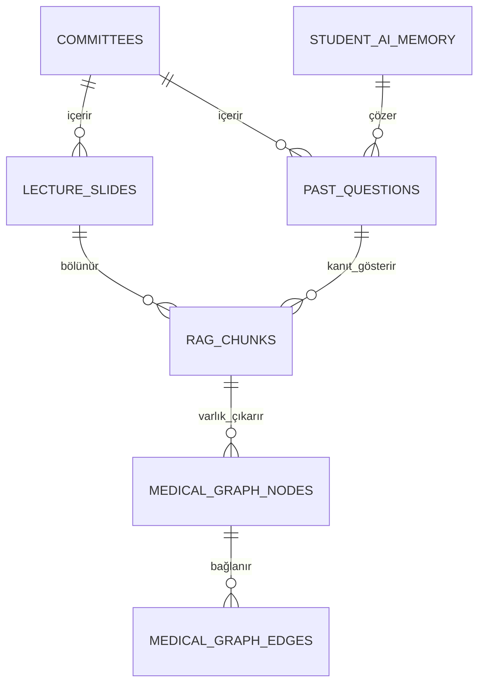

# MedSoru AI: Sistem Mimarisi, Boru Hattı ve Yapay Zeka Talimatnamesi (AGENTS.md)
> **Hedef Kitle:** Yapay Zeka Asistanları (Antigravity, Cursor, Claude, GPT, Ollama yerel modelleri) ve Geliştiriciler.  
> **Temel İlke:** Bu proje tamamen **yerel donanım (Zero-Cost Local GPU)** ve **kanıtlanabilir tıp verisi (Zero-Hallucination Medical RAG)** prensibiyle çalışır.

---

## 1. Proje Özeti ve Amaç
MedSoru, Tıp Fakültesi Dönem 3 kurul ders slaytları, amfi notları ve geçmiş çıkmış sınav sorularını otomatik işleyen, temizleyen, zenginleştiren ve anlamsal olarak birbirine bağlayan uçtan uca otonom bir yapay zeka tıp ekosistemidir.

### Temel Çıktılar:
1. **Doğrulanmış Soru Bankası:** 5 şıklı, amfi ders notundan kanıtlı, açıklamalı ve detaylandırılmış tıp soruları.
2. **GraphRAG & Hibrit Arama:** Hastalık-ilaç-semptom ilişkilerini içeren bilgi grafı (`DiGraph`) ve `BM25 + BGE-M3` hibrit arama motoru.
3. **MemGPT Hiyerarşik Bellek:** Öğrencinin dönem, hedef puan ve zayıf konularını takip eden LLM OS bellek katmanı.
4. **Web Arayüzü:** `localhost:3000` (`nofrostlife.com.tr`) ve Canlı Analiz Kokpiti (`localhost:8085`).

---

## 2. Dizin Yapısı ve Dosya Haritası

```
MedSoru Project/
├── meds/                                   # Ana Git Deposu (induiduel/meds)
│   ├── scripts/
│   │   ├── agents/                         # Otonom Boru Hattı ve Ajan Kodları
│   │   │   ├── pipeline_runner.py          # Aşamaları sırayla çalıştıran orkestratör
│   │   │   ├── stage1_extract.py           # Aşama 1: PDF/PPTX -> Ham Metin & OCR
│   │   │   ├── stage2_clean.py             # Aşama 2: Türkçe Onarım & A-E Soru Ayrıştırma
│   │   │   ├── stage3_merge.py             # Aşama 3: RAG Chunking, Vektörleme & Zenginleştirme
│   │   │   ├── stage4_database.py          # Aşama 4: Doğrulanmış veriyi meds_database'e aktarma
│   │   │   ├── watchdog.py                 # Otonom Donanım, Docker ve Süreç Denetleyicisi
│   │   │   └── lib.py                      # Ortak ML, GPU, Ollama, Metin ve State Kütüphanesi
│   │   ├── advanced_ai/                    # İleri Düzey AI Katmanı (Aşama 5)
│   │   │   ├── orchestrator.py             # Aşama 5 Orkestratörü
│   │   │   ├── graph_rag.py                # NetworkX DiGraph Tıbbi Bilgi Grafı
│   │   │   ├── hybrid_search.py            # BM25 + Dense BGE-M3 Hibrit Arama Motoru
│   │   │   ├── memory_os.py                # MemGPT Core/Recall Bellek Sistemi
│   │   │   └── react_guardrails.py         # ReAct Döngüsü & Halüsinasyon Engelleyici
│   │   └── training/                       # Yerel Tıp Modeli Eğitimi (Fine-Tuning)
│   │       ├── prepare_dataset.py          # Alpaca formatında eğitim çifti üretici
│   │       └── train_lora.py               # 4-bit QLoRA RTX 4060 eğitim betiği
│   ├── supabase/
│   │   └── migrations/                     # PostgreSQL, pgvector & GraphRAG Şemaları
│   │       ├── 20261001_initial_schema.sql
│   │       ├── 20261004_rag_vector_schema.sql
│   │       └── 20261005_advanced_ai_graph_hybrid.sql
│   ├── docker-compose.ollama.yml           # Optimize edilmiş Ollama GPU konteyneri
│   └── AGENTS.md                           # Bu dosya (AI & Sistem Talimatnamesi)
├── meds_temp/                              # NVMe SSD Geçici Çalışma Alanı (Git dışı)
│   ├── temp1/                              # Ham OCR / metin çıktıları
│   ├── temp2/                              # Düzeltilmiş metin ve ayrıştırılmış ham sorular
│   ├── temp3/                              # Chunk'lar, BGE-M3 vektörleri (.npy), metadata
│   │   └── advanced_ai/                    # Bilgi grafı JSON ve bellek veritabanı
│   └── state/                              # Diskcache SQLite önbelleği ve ilerleme logları
├── meds_database/                          # Doğrulanmış Nihai Tıp Veritabanı
│   ├── questions/                          # Sadece verified / fixed sorular
│   └── chunks/                             # Kanıtlanmış ders slayt parçaları
└── dashboard_server.py                     # Port 8085 Canlı Telemetri & DiGraph Kokpiti
```

---

## 2.1. Veritabanı ve Veri Şeması (Database Architecture)

Proje, hem yerel NVMe SSD önbelleğinde (SQLite/JSONL) hem de PostgreSQL / Supabase üzerinde iki katmanlı ilişkisel ve vektörel bir şema kullanır:



### PostgreSQL / Supabase Tablo Şeması:
1. **`committees`:** Tıp kurulu/komite tanımları (`id`, `name`, `academic_year`, `target_questions`).
2. **`lecture_slides` & `rag_chunks`:** Slayt sayfaları ve 900 karakterlik semantik paragraflar.
   - `id`: Benzersiz chunk ID (`{source_id}:p{page}:c{chunk_index}`)
   - `content`: Metin içeriği
   - `heading_path`: Dizin hiyerarşisi (`["Ders Adı", "Slayt Başlığı"]`)
   - `embedding`: BGE-M3 (1024d) veya Gemini kompakt vektör (`vector(768)`)
   - **İndeksler:** IVFFlat (`vector_cosine_ops`), GIN (`to_tsvector('simple', content)`)
3. **`past_questions`:** Çıkmış sınav soruları (`question_id`, `stem`, `options`, `answer`, `explanation`, `status`).
4. **`medical_graph_nodes` & `medical_graph_edges`:** GraphRAG tıbbi bilgi grafı.
   - `nodes`: `node_type` (`Ders`, `Konu`, `Hastalik`, `Belirti`, `Ilac`, `Gen`, `Soru`)
   - `edges`: `relation` (`NEDEN_OLUR`, `TEDAVİ_EDER`, `SEMPTOMUDUR`, `SORGULAR`, `İÇERİR`)
5. **`student_ai_memory`:** MemGPT öğrenci profili, dönem, hedef ve zayıf kalınan kurullar (`JSONB`).

## 3. Donanım ve Model Kuralları (ZORUNLU)

1. **GPU Offloading Kuralı:**  
   - Cihazda **NVIDIA GeForce RTX 4060 Laptop GPU (8 GB VRAM)** ve Intel UHD grafik kartı bulunmaktadır.
   - Tüm LLM ve Embedding çağrılarında **RTX 4060 kullanılmalıdır**.
   - Model çağrılarında katmanların CPU'ya düşmesini engellemek için her zaman **`-ngl 99`** (`options["num_gpu"] = 99`) kuralı uygulanır.
2. **Bellek / SSD Önbellek Kuralı:**  
   - Vektör ve ara işlemler için Python RAM belleğinde `dict` veya `pickle` biriktirilmez.
   - Doğrudan NVMe SSD üzerinde çalışan **`diskcache.Cache` (SQLite tabanlı)** kullanılır.
3. **Konteyner ve Süreç İzolasyonu:**  
   - `meds-ollama` konteyneri `OLLAMA_NUM_PARALLEL: 2`, `OLLAMA_FLASH_ATTENTION: 0`, `OLLAMA_KV_CACHE_TYPE: f16` ile çalışır.
   - Boşta kalan modeller `keep_alive: 24h` ile bellekte tutulur, `max_loaded_models: 1` ile izole edilir.
4. **Donanım Koruma ve Termal Güvenlik Freni (ZORUNLU):**
   - GPU yükü **%90** veya GPU çekirdek sıcaklığı **80°C** üzerine çıkamaz.
   - `lib.py` (`wait_for_gpu_safety`) ve `watchdog.py` (`enforce_gpu_thermal_and_load_limits`) her model ve embedding çağrısından önce GPU telemetrisini denetler; eşikler aşılırsa sistemi güvenli sıcaklığa inene kadar otomatik uyutur (Thermal Throttling).
5. **Kod Güncelleme Sonrası Yeniden Başlatma:**  
   - `scripts/agents/` dizinindeki bir `.py` dosyası düzenlendiğinde, arka plandaki Python süreci eski kodu çalıştırmaya devam eder.
   - Yeni kod yazıldığında çalışan süreç sonlandırılmalı (`kill -9`) veya `watchdog.py`'ın otomatik tazelemesine bırakılmalıdır.

---

## 4. Boru Hattı ve 7 Faz Mimarisi (7-Phase Execution Pipeline)

MedSoru ekosisteminde **Aşama (Stage)** ve **Faz (Phase)** kavramları birebir aynı süreci temsil eden **7 Adımlı Otonom Bir Mimariye** standardize edilmiştir:

| Faz / Aşama | Modül / Betik | Temel Görev ve Çıktı | Otomasyon Katmanı |
| :--- | :--- | :--- | :--- |
| **Faz 1 (Aşama 1)** | `read_document.py` (`stage1_extract`) | PDF/PPTX Ham Metin & OCR Çıkarımı (`temp1/`) | `pipeline_runner` |
| **Faz 2 (Aşama 2)** | `stage2_clean.py` | Türkçe Onarım & A-E Soru Ayrıştırma (`temp2/`) | `pipeline_runner` |
| **Faz 3 (Aşama 3)** | `stage3_merge.py` | RAG Chunking (900 Karakter) & BGE-M3 Vektörleme | `pipeline_runner` |
| **Faz 4 (Aşama 4)** | `stage4_database.py` & `sync_to_supabase_v2` | Doğrulanmış Soru & Slaytların `meds_database`'e Aktarımı | `pipeline_runner` |
| **Faz 5 (Aşama 5)** | `multi_ai_consensus_phase5.py` | Çoklu AI Konsensüsü & Slayt İğne-Delik Tespiti (`meds_database_v2`) | `pipeline_runner` + `watchdog` |
| **Faz 6 (Aşama 6)** | `deep_metadata_generator_phase6.py` | Derin Tıbbi Hiper-Metadata (ICD-10, Ayırıcı Tanı - Dinamik Hız) | `pipeline_runner` + `watchdog` |
| **Faz 6.5 (Aşama 6.5)** | `thesaurus_anchor_phase6_5.py` | Tıbbi Terimler Sözlüğü (Thesaurus) & Co-occurrence Kanıt Motoru | `pipeline_runner` + `watchdog` |
| **Faz 7 (Aşama 7)** | `microagent_storyteller_phase7.py` | 5 Adımlı Mikro-Ajans Soru Modelleme & Hikaye Motoru | `pipeline_runner` + `watchdog` |
| **Faz 7.5 (Aşama 7.5)** | `reconstruct_slides_phase7_5.py` | Amfi Ders Slaytlarını Resmi Müfredat Standartlarında Düzenleme | `pipeline_runner` + `watchdog` |

---

### Faz 1 (Aşama 1): Ham Çıkarım (`read_document.py` / `stage1_extract`)
- `downloads/` altındaki PDF ve PPTX dosyalarını PyMuPDF, EasyOCR/Tesseract ve Qwen3-VL ile tarar. Metinleri `temp1/` altına JSON formatında yazar.
- **İleri Seviye OCR İyileştirme Mimarisi:** Lanczos 2x büyütme, 2x2 kadrana bölme (tiling) ve Markdown tablo aktarımı.

### Faz 2 (Aşama 2): Türkçe Onarım ve Soru Ayrıştırma (`stage2_clean.py`)
- OCR gürültülerini temizler, kırık hece ve Türkçe karakterleri düzeltir.
- LLM ile Post-OCR Tıbbi Onarım (`Gemma 3` / `Qwen`) yaparak harf/rakam karışıklıklarını giderir.
- Çıkmış sorulardan `no`, `stem` ve `A-E` seçeneklerini ayıklar (`temp2/`). Destek oranı `>= 0.80` olmalıdır.

### Faz 3 (Aşama 3): RAG Bölümleme, Vektörleme & Zenginleştirme (`stage3_merge.py`)
- Slaytları 900 karakter hedef ve 120 karakter overlap ile doğal paragraf sınırlarından böler (`split_passages`).
- Her chunk'a `[Komite X | Ders | Başlık: ...]` metadata prefix'i enjekte edilir.
- `bge-m3` ile 1024 boyutlu vektöre dönüştürülüp SSD `diskcache`'e kaydedilir.
- Hakem Ajan kuralları: `>= 0.85` verified/fixed; `0.65-0.85` review queue; `< 0.65` needs_fix.

### Faz 4 (Aşama 4): Doğrulama ve Veritabanı Taşıma (`stage4_database.py` & `scripts/sync_to_supabase_v2.py`)
- Sadece `status == "verified"` veya `status == "fixed"` olan sorular `meds_database/` dizinine ve Supabase tablolarına aktarılır.
- Toplu aktarımda `execute_batch` (batch_size=1000) kullanılır, ardından HNSW ve GIN indeksleri tetiklenir.
- Mevcut öğrenci yorumları ve like/dislike oyları korunur.

### Faz 5 (Aşama 5): Çoklu AI Konsensüsü & Slayt İğne-Delik Tespiti (`multi_ai_consensus_phase5.py`)
- Soru ve slaytlar yerel RTX 4060 GPU (`gemma3:4b`) ve Bulut AI (`gpt-oss-120b` / `qwen` / `gemini-3.8-flash`) tarafından ortak konsensüse alınır.
- Pedagojik amaç ve tıbbi varlıklar (hastalık, ilaç, patojen, semptom vb.) çıkarılır.
- Hangi slayt dosyasının hangi sayfasındaki hangi metin parçasıyla (chunk) örtüştüğü kesin olarak teyit edilir.
- Yanlış kurul, yanlış ders atanan sorular denetlenir (`classification_audit`); geçersizler `blacklist/` altına izole edilir.
- Çıktılar mevcut veritabanını bozmadan `meds_database_v2/` altına parça parça (JSONL) yazılır.

### Faz 6 (Aşama 6): Derin Tıbbi Hiper-Metadata Motoru (`deep_metadata_generator_phase6.py`)
- Çoklu Yapay Zeka Katmanı (RTX 4060 GPU Gemma 3, OpenRouter / Muse Spark, Groq Cloud, Gemini Flash) kullanır.
- Dinamik Hız Kontrolü: 5 ila 10 dakikada 5 soru, her 2 saatte bir 1 tam amfi ders notu işleme temposuyla arka planda otonom çalışır.
- ICD-10 kodları, ayırıcı tanı, multidisipliner tıp bağları ve hiper-arama etiketleri üretir.

### Faz 6.5 (Aşama 6.5): Tıbbi Terimler Sözlüğü (Thesaurus) & Co-occurrence Kanıt Motoru (`thesaurus_anchor_phase6_5.py`)
- Türkçe tıp terminolojisi, Latince karşılıklar ve hekim jargonunu içeren çok katmanlı ontoloji (`medical_thesaurus.json`) oluşturur.
- Çıkmış sorular ile ders slaytları arasındaki ortak tıbbi terimleri tarar.
- **Çoklu Ders Eşleşme Çözümü:** Birden fazla slaytta geçen terimler için `Co-occurrence Skoru = (Ortak Terim Sayısı) * (Özgüllük Ağırlığı) * (Yoğunluk) + (Jaccard * 10)` formülünü kullanarak en yüksek örtüşmeye sahip slaytı kesin kanıt (`phase6_5_question_slide_anchors.jsonl`) olarak kancalar.

### Faz 7 (Aşama 7): 5 Adımlı Mikro-Ajans Soru Hikaye & Modelleme (`microagent_storyteller_phase7.py`)
- Kısıtlı parametreli yerel modellerin bilişsel yükünü 5 atomik mikro-adıma böler:
  1. *İzole Varlık Çıkarımı:* Soru kökündeki hedef yapı ve sistemi sert JSON olarak çıkarır.
  2. *RAG Destekli Doğrulama:* Amfi slayt chunk'ından kanıtı doğrular, halüsinasyonu sıfırlar.
  3. *Çeldirici Otopsisi:* Her yanlış seçeneği döngüsel olarak tek tek inceleyip hocanın tuzağını ve asıl tıp tanımını saptar.
  4. *Kavramsal Çerçeve:* Neden-sonuç ilişkisini 2 maddelik mantık köprüsüne oturtur.
  5. *Sentez & Hikayeleştirme:* Akıcı Türkçe, hekimlik nosyonu ve klinik analojiyle öğrencinin aklında kalıcı hikaye üretir.
- 100 altın standart soruluk rehber veri seti (`training_data/phase7_microagent_100_exemplars.jsonl`) üretir.
- Duraksama / kurtarma desteği ile her adım anında diske yazılır (`meds_database_v2/phase7_stories`).

### Faz 7.5 (Aşama 7.5): Amfi Ders Slaytlarını Resmi Müfredat Standartlarında Düzenleme (`reconstruct_slides_phase7_5.py`)
- KBÜ Tıp Fakültesi Dönem 3 resmi kurul hedeflerini (`TIP320`, `TIP340`, `TIP350`, `TIP360`) haritalar.
- Müfredat dışı sapmaları engeller; slaytları resmi konu başlığı, öğrenim hedefleri (tanım, patogenez, ayırıcı tanı, tedavi), anahtar kavramlar ve kancalanan çıkmış sorularla zenginleştirilmiş ders kartlarına dönüştürür (`meds_database_v2/slide_reconstructed`).

---

## 5. Denetleyici ve Otonom Kurtarma (Watchdog)

[`scripts/agents/watchdog.py`](file:///home/indu/Masaüstü/MedSoru%20Project/meds/scripts/agents/watchdog.py) sistemi sürekli izler:
- `llama-server` süreçlerinde `-ngl 3` (CPU taşması) görürse süreci temizler ve tam GPU ile yeniden başlatır.
- Ajan kodları güncellendiğinde bayat Python süreçlerini otomatik tazeler.
- `meds-ollama` konteyneri durursa anında `docker start` yapar.
- `dashboard_server.py` kapanırsa anında yeniden çalıştırır.
- `server.ts` (Web Sunucusu - Port 3000) kapanır veya yanıt vermezse anında otonom olarak yeniden başlatır.
- Sistem RAM'i %92'nin üzerine çıkarsa acil bellek ve VRAM tahliyesi yapar.

---

## 6. Yeni Geliştirici ve AI Asistanı İçin Talimatlar

1. **Kod Yazarken:**
   - Herhangi bir model çağrısı yapacaksanız [`scripts/agents/lib.py`](file:///home/indu/Masaüstü/MedSoru%20Project/meds/scripts/agents/lib.py) içindeki `lib.chat()` ve `lib.embed()` fonksiyonlarını kullanın. Asla doğrudan kontrolsüz `requests.post` yazmayın.
   - Dışarıdan bilgi uydurmayı engelleyen koruma mekanizmalarını (`support_ratio`) bozmayın.
2. **Sistem Durumunu İzlerken:**
   - `http://localhost:8085` kokpit arayüzünü kontrol edin.
   - Terminalde `nvidia-smi` çıktısında GPU kullanımının aktif ve VRAM'in 3.5 - 4.5 GB bandında olduğunu doğrulayın.
3. **Yeni Bir Algoritma veya Script Eklendiğinde:**
   - Bu `AGENTS.md` ve `PROJECT_INSTRUCTIONS.md` dosyalarını güncelleyin.
   - Yeni scripti `pipeline_runner.py` veya `watchdog.py` izleme listesine ekleyin.
   - Değişiklikleri Git `main` dalına commit ve push yapın.

---

## 7. Yerel QLoRA Fine-Tuned Model & Yetkilendirmeler
- **Model Adaptörü Konumu:** `meds/models/medsoru-d3-qlora` (Çevrimdışı / Bağımsız model)
- **HuggingFace Yetkilendirmeleri:**
  - `meds2` (Inference / Hub Okuma): `HF_TOKEN_MEDS2` (`.env`)
  - `meds3` (Write Access / Model Yükleme): `HF_TOKEN_MEDS3_WRITE` (`.env`)
- **Web Sohbet Kuralı (ZORUNLU):** QLoRA modeli web arayüzünde (`nofrostlife.com.tr` / localhost:3000) sohbet ajanı olarak **asla kullanılmaz**. Web sohbetinde model seçimi devre dışı bırakılmıştır; yerel modda sabit olarak `gemma3:4b`, bulut modunda sabit olarak `gemini-3.8-flash` çalışır. QLoRA ağırlıkları bağımsız araştırma ve çevrimdışı tıp modeli olarak korunur.

---

## 8. Arka Plan Soru Kalite Denetçisi ve Çoklu AI Sohbet Mimarisi

### 8.1. Otonom Soru Kalite Denetçisi (`question_quality_inspector.py`)
- **İşleyiş:** Arka planda donanımı (RTX 4060 GPU / CPU) yormadan yavaşça (throttled micro-sleep) 6.263 çıkmış soruyu tarar.
- **Denetim Parametreleri:**
  1. **Mükerrer & Tekrarlanan Soru:** Token Jaccard / Levenshtein benzerliği >= 0.88 olan mükerrer kopyaları tespit eder (`duplicates`).
  2. **Bozuk Karakter & OCR Hataları:** Mojibake (UTF-8 çift kodlama), rakam-harf karışımı gürültüler (0->O, 1->I) ve tipografik ligatürleri bulup onarım önerir.
  3. **Şık & Kök Bütünlüğü:** 4 veya 5 şıkkı olmayan, içeriği boş kalan şıkları ve 15 karakterden kısa anlamsız taslak kökleri belirler.
  4. **Tıbbi Anabilim Dalı Uyuşmazlığı:** Soru metnindeki yoğun kavramları analiz ederek hatalı branş etiketlerini (`discipline mismatch`) tespit eder.
- **Raporlama:** Çıktılar `meds_temp/state/quality_audit_suggestions.json` içine yapılandırılmış olarak yazılır ve `/api/audit/status` endpoint'i üzerinden web kokpitine sunulur.

### 8.2. Web AI Tıp Asistanı & Soru Dedektifi (`/asistan` - `LocalAiChatView.tsx`)
- **Yerel GPU (RTX 4060):** Ollama üzerinden `gemma3:4b`, `deepseek-r1:8b`, `qwen3:1.7b` ve eğitilen `qLoRA` modellerini sıfır maliyetle çalıştırır.
- **İnternet & Bulut Modelleri:** Kota tükenmelerine karşı Google Gemini Flash, Groq Cloud (GPT-OSS 120B) ve sınırsız Muse Spark 1.3 Free katmanlarını otomatik devreye sokar.
- **Özel Klinik Modlar:**
  - **Soru Dedektifi (`find_question`):** Öğrencinin "50 yaş hasta, hiperkalsemi ve lityum vardı" gibi eksik hatırladığı soruları BM25 + BGE-M3 RAG ile veritabanından bulup şıkları ve açıklamasıyla getirir.
  - **Soru Türetici (`generate_from_keywords`):** Verilen anahtar kelimelerden doğru kurul, ders ve konuyu saptayarak 5 şıklı orijinal kurul soruları yazar.
  - **Klinik Mekanizma:** Tıbbi patofizyolojik ve farmakolojik derin açıklamalar sunar.

### 8.3. Soru Yaşı ve Değerlendirme Sistemi
- **Yeni Soru vs Arşiv:** 2026-2027 kurul soruları ile geçmiş yılların çıkmışları yeşil (`Yeni Soru`) ve gri (`Geçmiş Yıl`) rozetlerle ayrıştırılır; filtreleme paneline `new_only` ve `archived_only` seçenekleri eklenmiştir.
- **Çift Yönlü Like / Dislike:** Her çıkmış soru için hem `upvotes` hem de `downvotes` sayaçları çalışır; oylar yerel veritabanı ile Supabase `past_questions` tablosunda anlık senkronize edilir.

---

## 9. Faz 5 & Faz 6: Çoklu AI Konsensüsü ve Derin Hiper-Metadata Mimarisi

### 9.1. Faz 5: Ortak Çoklu AI Konsensüs & Soru Analiz Motoru (`scripts/advanced_ai/multi_ai_consensus_phase5.py`)
- **Hibrit AI Konsensüsü:** Her çıkmış tıp sorusu eşzamanlı olarak yerel RTX 4060 GPU (`gemma3:4b` / `medgemma`) ve Bulut AI (Groq `gpt-oss-120b` / `qwen` / Gemini 3.8 Flash) tarafından ortak işleme alınır.
- **Tıbbi Mantık & Pedagojik Kazanım:** Sorunun ölçtüğü temel klinik/patolojik mekanizma ortaya çıkarılır.
- **Amfi Slayt İğne-Delik Tespiti:** Sorunun doğrudan hangi dersin hangi slayt sayfasındaki metin parçasıyla (chunk) örtüştüğü BM25 + anahtar terim eşleşmesiyle doğrulanır.
- **Tıbbi Varlık Çıkarımı:** Soruya ait *hastalık, ilaç, patojen, gen, belirti, semptom, etiyoloji, tedavi, ölçüm* bileşenleri yapılandırılmış JSON olarak çıkarılır.
- **Hatalı Sınıflandırma ve Karantina:**
  - Yanlış kurula, derse veya konuya atanmış sorular tespit edilip düzeltilmiş etiketler önerilir (`classification_audit`).
  - Yazım hatalı veya eksik soru kökleri onarılır; geçersiz (stem < 15 karakter, eksik şıklı) sorular `blacklist/` altına izole edilir.
- **Veritabanı İzolasyonu:** Mevcut `meds_database` korunur; tüm çıktılar `meds_database_v2/questions` ve `blacklist/` altına parça parça (chunked JSONL) yazılır.

### 9.2. Faz 6: Derin Tıbbi Hiper-Metadata Motoru (`scripts/advanced_ai/deep_metadata_generator_phase6.py`)
- **Çoklu AI Katmanı:** Yerel RTX 4060 GPU (`gemma3:4b`), OpenRouter / Muse Spark 1.3 Free, Groq Cloud (`llama-3.3-70b` / `qwen`) ve Google Gemini Flash ortak havuzundan beslenir.
- **Dinamik Hız & Kota Koruması:** 5 ila 10 dakikada bir 5 soru, 2 saatte bir 1 tam ders notu işleme temposuyla donanımı ve API kotalarını yormadan arka planda otonom çalışır.
- **Üretilen Derin Boyutlar:**
  - ICD-10 kodları ve klinik protokoller.
  - Ayırıcı tanı (diferansiyel tanı) eşleşmeleri ve klinik farklar.
  - Multidisipliner entegrasyon (Patoloji + Farmakoloji + Klinik branş kesişimleri).
  - Tıbbi hiper-arama etiketleri (BM25 ve BGE-M3 arama motorunu güçlendiren hekim jargonu ve Latince/İngilizce terimler).
  - Amfi ders notları için klinik özetler, tuzak sınav noktaları ve vaka senaryoları.
- **Otonom Kurtarma & Watchdog:** Hem Faz 5 hem de Faz 6 motorları `watchdog.py` tarafından kesintisiz olarak izlenir ve arka planda güvenle yürütülür.

---

## 10. Sıfır Komutlu Docker ve Web Otomasyon Mimarisi (Zero-Command Automation)

### 10.1. Otonom Konteyner Başlatıcı (`Dockerfile` & `docker/entrypoint.sh`)
- Sistem açıldığında veya `docker compose up -d` komutu verildiğinde hiçbir manuel betik çalıştırmaya gerek kalmadan:
  1. `dashboard_server.py` (Port 8085 Analiz Kokpiti) otomatik başlar.
  2. `watchdog.py` devreye girerek arka planda Faz 5 (`multi_ai_consensus_phase5.py`) ve Faz 6 (`deep_metadata_generator_phase6.py`) motorlarını otonom yürütür.
  3. `pipeline_runner.py` Aşama 1 -> 2 -> 3 -> 4 -> 5 döngüsünü sürekli çalıştırır.
  4. Web arayüzü ve API sunucusu (`server.ts` - Port 3000) canlıya geçer.

### 10.2. Web Otomasyon Kokpiti & Dashboard Entegrasyonu
- **Merkezi Runner:** [`scripts/automation-runner.mjs`](file:///home/indu/Masaüstü/MedSoru%20Project/meds/scripts/automation-runner.mjs) içine `phase5-multi-ai-consensus` ve `phase6-deep-metadata-generator` boru hatları eklenmiştir; web UI üzerinden tek tıkla tetiklenebilir ve logları izlenebilir.
- **Canlı Telemetri:** [`dashboard_server.py`](file:///home/indu/Masaüstü/MedSoru%20Project/meds/dashboard_server.py) Port 8085 üzerinde Aşama 6 (Konsensüs) ve Aşama 7 (Hiper-Metadata) ilerlemelerini, günlük kota durumunu ve karantinaya alınan soruları canlı olarak gösterir.


