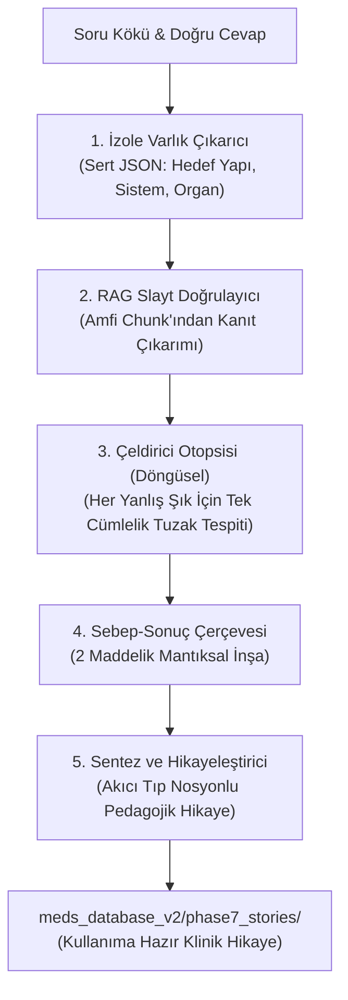

# Faz 7: 5 Adımlı Mikro-Ajans (Micro-Agent) Tıbbi Modelleme ve Öğretim Talimatnamesi (PHASE7_INSTRUCTIONS.md)

> **Amaç:** Kısıtlı parametreli yerel yapay zeka modellerinin (RTX 4060 GPU üzerindeki Gemma 3 4B, Llama 3 8B, Qwen 2.5 7B vb.) bilişsel yükünü (Cognitive Load) sıfırlayarak halüsinasyonsuz, kanıt temelli ve pedagojik olarak hikayeleştirilmiş tıp açıklamaları üretmesini sağlamak.  
> **Temel Prensip:** **"Böl ve Yönet" (Divide & Conquer)**. Büyük görevler tek bir uzun komutla modele verilmez; 5 atomik mikro-adıma parçalanır ve her adımın çıktısı sonraki adımın girdisi olur.

---

## 1. Altın Kurallar ve Katı Kısıtlamalar

1. **İzole Görev Kuralı:** Hiçbir adımda modele "Hem varlık çıkar hem açıkla hem de hikaye yaz" denilemez. Her adım yalnızca kendi görev tanımını icra eder.
2. **Sert JSON & Sıfır Gevezelik:** Adım 1 ve Adım 3'te modelden serbest metin veya nezaket ifadeleri ("Tabii ki", "İşte analiz") kesinlikle kabul edilmez; çıktı salt JSON veya tek bir kısa cümle olmalıdır.
3. **Bağlam Dışına Çıkmama (Zero-Hallucination):** Adım 2 ve Adım 4'te model kendi parametrik hafızasından bilgi uyduramaz; sadece sunulan slayt metni ve önceki adımların verileri üzerinden mantık yürütür.
4. **Çeldirici Otopsisi (Döngüsel İzolasyon):** Şıklar modele toplu halde verilmez; Python `for` döngüsü ile tek tek sorulur.
5. **Kalıcı Durum (Stateful Continuation):** Sistem kesintiye uğrasa dahi `meds_database_v2/phase7_stories/phase7_state.json` sayesinde kaldığı sorudan devam eder; üretilen çıktılar anında diske yazılır ve kullanıma hazırdır.

---

## 2. 5 Adımlı Mikro-Ajan İş Akışı



---

### Adım 1: İzole Varlık Çıkarıcı (Entity Extractor)
* **Rol:** Tıbbi Veri Çıkarıcı Ajan.
* **Görev:** Yorum yapmadan soru kökündeki hedef anatomik yapıyı, biyokimyasal basamağı, mikroorganizmayı veya patolojik bulguyu izole etmek.
* **Girdi:** Soru kökü.
* **Sistem Komutu:**
  ```text
  Sen bir tıbbi veri çıkarıcı ajansın. Sana verilen tıp sorusunu analiz et. Soru kökündeki ana yapıyı (Anatomi, Biyokimya, Patoloji veya Fizyoloji objesi) ve bulunduğu sistemi/organı bul. ASLA açıklama yapma, SADECE belirtilen JSON formatında çıktı ver.
  ```
* **Çıktı Şeması:**
  ```json
  {
    "hedef_yapi": "Hız kısıtlayıcı enzim",
    "substrat_veya_bolge": "Fruktoz 6-fosfat",
    "urun_veya_etki": "Fruktoz 1,6-bifosfat",
    "sistem_yolak": "Glikoliz yolağı"
  }
  ```

---

### Adım 2: RAG Destekli Doğrulama (Halüsinasyon Kesici)
* **Rol:** Slayt Kanıt Denetmeni.
* **Görev:** Adım 1'deki varlıkları ve soruyu kullanarak amfi ders slaytında yer alan kesin amfi bilgisini doğrulamak.
* **Girdi:** Slayt Chunk Metni + Soru Kökü.
* **Sistem Komutu:**
  ```text
  Aşağıdaki [DERS NOTU BAĞLAMI]'nı kullanarak, [SORU KÖKÜ]'nün cevabını bul. Sadece bağlamda yazan bilgiyi kullan. Kendi bilgini ekleme. Bulamazsan 'Bağlamda yok' de.
  ```
* **Çıktı:** Tek cümlelik doğrulanmış amfi kanıtı.

---

### Adım 3: Çeldirici Otopsisi (Döngüsel İzolasyon)
* **Rol:** Sınav Tuzağı ve Çeldirici Analisti.
* **Görev:** Yanlış seçeneklerin (çeldiricilerin) hocalar tarafından hangi amaçla konduğunu ve o seçeneğin asıl tıp tanımını tek bir cümleyle ortaya çıkarmak.
* **Girdi:** Doğru cevap + İncelenen tek bir çeldirici seçenek.
* **Sistem Komutu:**
  ```text
  Doğru cevap [DOĞRU_CEVAP]'dır. Ancak seçeneklerden birinde '[SECENEK_METNI]' bulunmaktadır. Bu yapının/ilacın/kavramın tıptaki asıl görevi veya özelliği nedir? Tek bir kısa cümleyle özetle.
  ```
* **Çıktı:** İlgili şıkkın 1 cümlelik klinik otopsisi.

---

### Adım 4: Kavramsal Çerçeve (Sebep-Sonuç İnşası)
* **Rol:** Mantık Köprüsü Kurucu.
* **Görev:** Adım 1, 2 ve 3'ten gelen verileri birleştirerek olayın biyolojik amacını 2 maddelik bir neden-sonuç zincirine oturtmak.
* **Girdi:** Adım 1 + Adım 2 + Adım 3 çıktıları.
* **Sistem Komutu:**
  ```text
  Bir öğrenciye bu konunun neden kritik olduğunu açıklayacaksın. Elimizdeki veriler: [Adım 1, 2, 3 Çıktıları]. Konunun tıp pratiğindeki ve fizyopatolojisindeki asıl amacını neden-sonuç ilişkisi kurarak tam 2 maddede yaz.
  ```
* **Çıktı:** 2 maddelik mantıksal çerçeve.

---

### Adım 5: Sentez ve Hikayeleştirici (Final Storyteller)
* **Rol:** Kıdemli Klinik Mentor ve Hikaye Anlatıcı.
* **Görev:** Önceki adımlarda toplanan tüm doğrulanmış verileri; akıcı, hekimlik nosyonuna uygun, analojiler içeren ve akılda kalıcı bir tıp anlatısına dönüştürmek.
* **Girdi:** Soru + Doğru Cevap + Çeldiricilerin Otopsisi + 2 Maddelik Neden-Sonuç.
* **Sistem Komutu:**
  ```text
  Sen zeki, bilimsel ama bir tıp öğrencisinin anlayacağı kadar akıcı dille konuşan bir çalışma asistanısın.
  Aşağıdaki ham verileri birleştirerek, öğrencinin aklında kalacak bir 'olay örgüsü' yaz.

  Kurallar:
  1. Madde imi kullanma, bir hikaye/klinik analoji gibi anlat.
  2. Ezberletme, mantığını ve çeldiricilerin neden konduğunu açıkla.
  3. Tıbbi terimleri doğru kullan, bağlamdan asla sapma.
  ```
* **Çıktı:** 1-2 paragraflık eksiksiz klinik hikaye.

---

## 3. Duraksama ve Kurtarma Garantisi (Resilience & State)
* Sistem her soru için 5 adımı tamamladığında sonucu anında `meds_database_v2/phase7_stories/*.jsonl` dosyasına yazar.
* `phase7_state.json` içinde işlenen `question_id` kaydedilir.
* Elektrik kesilse, donanım ısınsa veya süreç kapansa dahi yeniden başlatıldığında kaldığı sorudan devam eder; üretilmiş olan hiçbir veri kaybolmaz.
