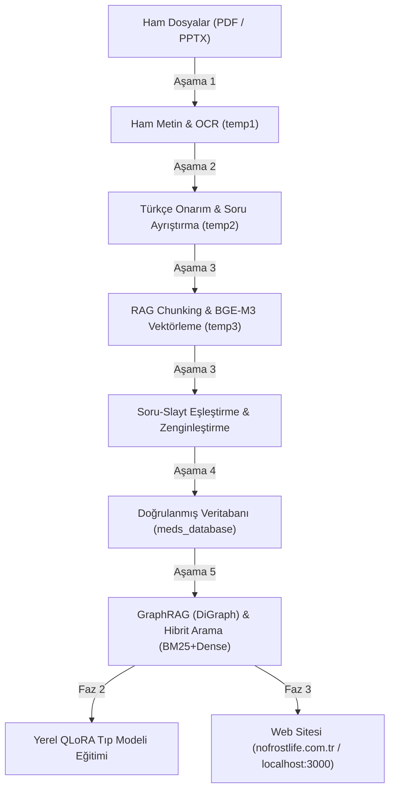

# 🏥 MedSoru AI: Kapsamlı Proje Tanımı, Yol Haritası ve Çalışma Talimatları

> **Versiyon:** 2.5 (2026 Hibrit RAG & Otonom Ajan Mimarisi)  
> **Lisans / Kapsam:** Tamamen Yerel (Local AI), Açık Kaynak, Sıfır Maliyetli Tıp Eğitimi Ekosistemi

---

## 📌 1. Proje Vizyonu ve Temel İlkeler

MedSoru, Tıp Fakültesi Dönem 3 öğrencilerinin amfi ders notlarını, slaytlarını ve çıkmış sınav sorularını yapay zeka ile işleyen, birbirine bağlayan ve akıllı bir soru bankası haline getiren yerel bir yapay zeka sistemidir.

### 4 Altın İlke:
1. **Sıfır Bulut Bağımlılığı (Zero Cloud / Local-First):** Tüm modeller (Gemma 3, Qwen 3, DeepSeek, BGE-M3) internet gerektirmeden yerel RTX 4060 GPU üzerinde çalışır.
2. **Sıfır Tıbbi Uydurma (Zero Hallucination):** Hiçbir yapay zeka dışarıdan ezbere bilgi ekleyemez. Her soru, şık ve açıklama amfi ders slaytında geçen metinlerle en az %80 oranında desteklenmek zorundadır (`support_ratio >= 0.80`).
3. **Akademik Soru Onarımı:** Eksik veya yarım hatırlanan çıkmış sorular, ilgili ders slaytı bulunarak tam akademik soru köküne dönüştürülür ve 5 şıklı yapıya tamamlanır.
4. **Otonom Donanım Denetimi:** Watchdog servisi, sistemin kilitlenmesini, GPU yerine CPU'ya taşmasını ve bellek sızıntılarını 7/24 engeller.

---

## 🗺️ 2. Uçtan Uca Yol Haritası ve Aşamalar



### Aşama Detayları:
- **Aşama 1 (`stage1_extract.py`):** 535 dosyanın tamamı okunur. Sayfa sayfa metinler ve taranmış slaytlar Qwen3-VL ile OCR'a dökülür.
- **Aşama 2 (`stage2_clean.py`):** Karakter bozuklukları düzeltilir, 14.000'den fazla çıkmış soru numarası, kökü ve şıklarıyla ayrıştırılır.
- **Aşama 3 (`stage3_merge.py`):** Slaytlar 900 karakterlik semantik parçalara bölünür ve BGE-M3 ile 1024 boyutlu vektörlere dönüştürülür. Sorular slaytlarla eşleştirilip eksik şıklar tamamlanır.
- **Aşama 4 (`stage4_database.py`):** Sadece slayt kanıtı olan onaylı sorular nihai veritabanına taşınır.
- **Aşama 5 (`scripts/advanced_ai/orchestrator.py`):**
  - **GraphRAG:** Hastalık, ilaç, belirti ve dersler arasında yönlü bilgi grafı (`DiGraph`) kurar.
  - **Hybrid Search:** BM25 anahtar kelime sıklığı ile BGE-M3 vektör benzerliğini birleştirir.
  - **MemGPT:** Öğrencinin zayıf olduğu konuları ve soru geçmişini takip eden 3 katmanlı bellek sağlar.

---

## 🛠️ 3. Kullanılan Yapay Zeka Modelleri ve Görevleri

| Model | Boyut / Tip | Rolü ve Görevi | Konfigürasyon |
| :--- | :--- | :--- | :--- |
| **`gemma3:4b`** | 4.3B Q4_K_M | Türkçe metin onarımı, soru kökü genişletme, şık tamamlama | `-ngl 99` (Tam RTX 4060 GPU) |
| **`bge-m3:latest`** | 566M F16 (1024d) | Slayt ve soru vektörleştirme, RAG semantik arama | `batch=64` (GPU Tensör Hızlandırma) |
| **`qwen3-vl:8b`** | 8.8B Vision | Taranmış eski PDF ve slayt görsellerinden metin okuma | Gerekli slaytlarda dinamik yükleme |
| **`deepseek-r1:8b`** | 8.2B Reasoning | Karmaşık klinik akıl yürütme ve çelişkili soru denetimi | İnceleme kuyruğu filtreleme |

---

## ⚡ 4. Çalıştırma, Denetleme ve İzleme Komutları

### Kokpit Arayüzü:
- **Dashboard:** `http://localhost:8085` (Canlı GPU yükü, ilerleme çubuğu, dosya tablosu ve interaktif DiGraph grafiği).
- **Web Uygulaması:** `http://localhost:3000` (MedSoru öğrenci arayüzü).
- **Open WebUI:** `http://localhost:8080` (Yerel modellerle serbest sohbet).

### Servis Yönetimi:
```bash
# Boru hattını başlatma (uyku engelleyici ile)
nohup /usr/bin/systemd-inhibit --what=idle:sleep --why=medsoru \
  /home/indu/Masaüstü/MedSoru\ Project/meds/.venv-ocr/bin/python \
  /home/indu/Masaüstü/MedSoru\ Project/meds/scripts/agents/pipeline_runner.py > /tmp/runner.log 2>&1 &

# Otonom Watchdog denetleyicisini başlatma
nohup /home/indu/Masaüstü/MedSoru\ Project/meds/.venv-ocr/bin/python \
  /home/indu/Masaüstü/MedSoru\ Project/meds/scripts/agents/watchdog.py > /tmp/watchdog.log 2>&1 &

# GPU ve Donanım durumunu anlık izleme
watch -n 1 nvidia-smi
```

---

## 🔄 5. Güncelleme ve Genişletme Protokolü

Projeye yeni bir algoritma, model veya script eklendiğinde şu protokol uygulanır:
1. **GPU Ayarı:** Yeni eklenen model çağrıları `options["num_gpu"] = 99` ile tam GPU'ya yönlendirilmelidir.
2. **Bellek Güvenliği:** Veriler RAM'de biriktirilmemeli, `diskcache` SQLite veya disk dosyalarına yazılmalıdır.
3. **Watchdog Listesi:** Yeni eklenen Docker konteyneri veya kritik servisler `scripts/agents/watchdog.py` içindeki denetim döngüsüne eklenmelidir.
4. **Belgelendirme:** Değişiklikler hem bu `PROJECT_INSTRUCTIONS.md` dosyasına hem de `AGENTS.md` dosyasına işlenerek Git'e pushlanmalıdır.
